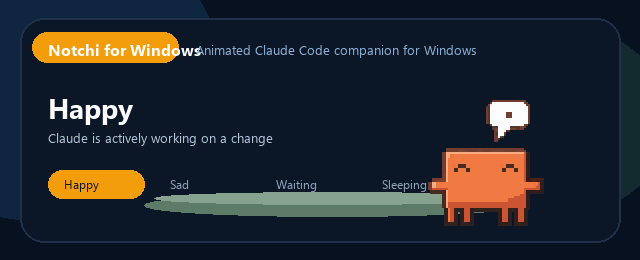

# Notchi for Windows

A Windows desktop port of [sk-ruban/notchi](https://github.com/sk-ruban/notchi), built for Claude Code.

This version keeps the original pixel mascot and sprite sheets, but adapts the app to Windows with a small always-on-top overlay, PowerShell hooks, and local event listening.

## Quick Look



Animated preview of `happy`, `sad`, `waiting`, and `sleeping` state transitions.

## What It Does

- Reacts to Claude Code activity in real time
- Shows one sprite per Claude Code session
- Uses the original Notchi sprite animations from the upstream project
- Switches between `idle`, `working`, `waiting`, `compacting`, and `sleeping`
- Switches emotions between `neutral`, `happy`, `sad`, and `sob`
- Lets you hide to a compact mascot-only view or expand into a detail panel

## Current Status

The Windows port is usable, but it is still not a full 1:1 port of the original macOS app.

Implemented today:

- Windows hook installer for Claude Code
- Local TCP event listener
- Multi-session sprite rendering
- Detail panel with recent prompt, reply, and activity info
- Automatic state and emotion switching
- Original upstream sprite-sheet assets

Not ported yet:

- macOS notch UI
- Sparkle auto-updates
- macOS keychain integration
- exact visual parity with the native Swift app

## Run

```powershell
cd C:\Users\admin\Desktop\Codex\notchi\windows
python app.py
```

On launch, the app starts in hide mode and attempts to install the Claude Code hook automatically.

More Windows-specific notes are in [windows/README.md](windows/README.md).

## Project Structure

- [windows/](windows/README.md): Windows app and PowerShell hook
- [notchi/notchi/Assets.xcassets](notchi/notchi/Assets.xcassets): original upstream sprite assets

## Attribution

This project is based on the original [sk-ruban/notchi](https://github.com/sk-ruban/notchi) project.

Credits to the original authors for:

- the app concept
- sprite art and animation
- macOS implementation and interaction design

## License

MIT. Please also see the original upstream repository for its history and attribution.
